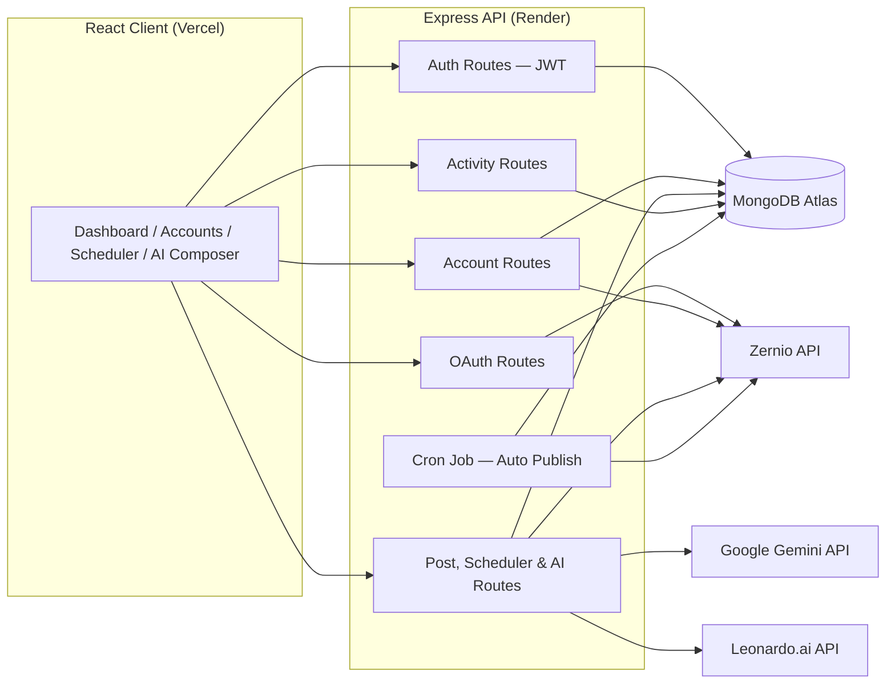
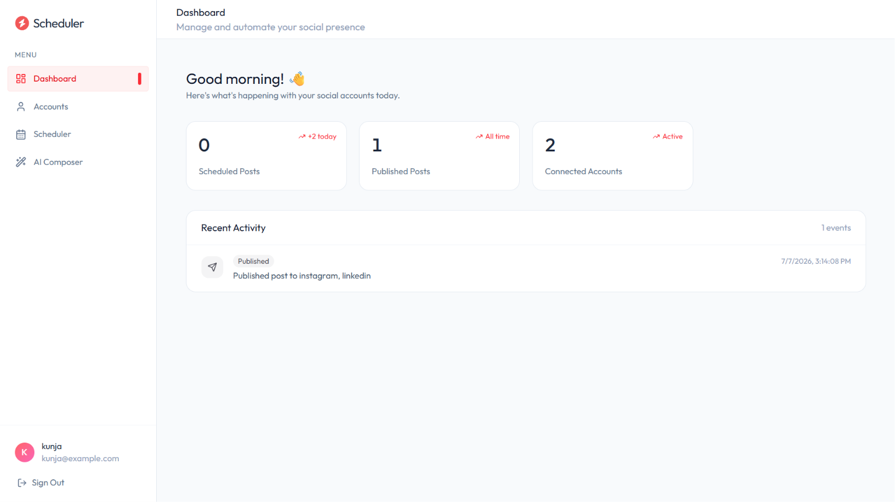
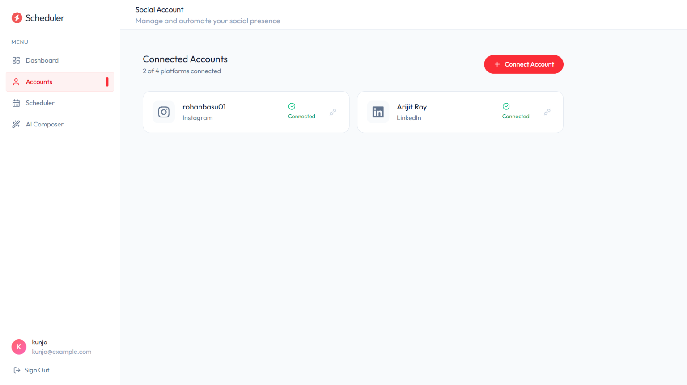
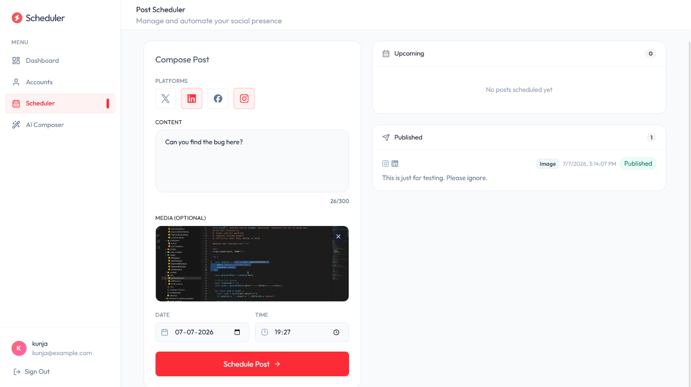
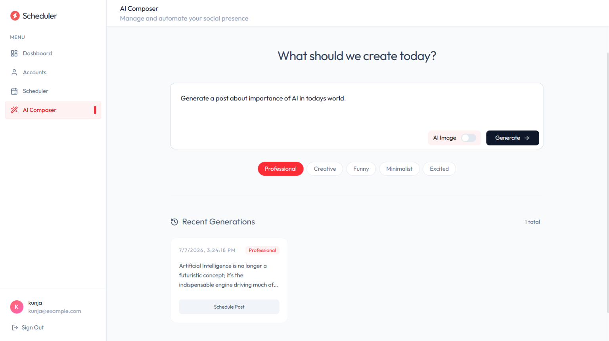
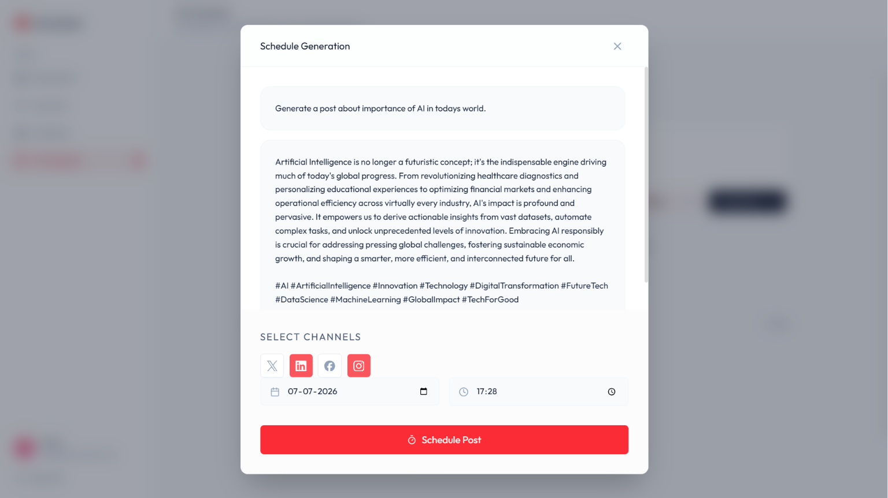

# 🚀 AI Social Media Scheduler

Manage and automate your social media presence — connect accounts, schedule posts across platforms, and let AI write and design your content for you.

**Live App:** [social-media-scheduler-beige-five.vercel.app](https://social-media-scheduler-beige-five.vercel.app)

---

## 📖 Overview

Running a presence across multiple social platforms usually means juggling separate logins, reformatting the same content for each app, and remembering to actually hit "post" at the right time. **AI Social Media Scheduler** collapses all of that into one dashboard: connect your accounts once, compose a post for every platform at the same time, and — when you're out of ideas — let an AI assistant write the caption and generate an image for you.

It's built end-to-end on the **MERN stack** (MongoDB, Express, React, Node.js). Google's **Gemini API** and **Leonardo.ai** power the content-generation side, while **Zernio** handles the hard part of social integrations — OAuth across platforms and the actual publishing — so the app never has to touch raw platform credentials directly.

---

## ✨ Features

- **Dashboard** — at-a-glance stats (scheduled posts, published posts, connected accounts) plus a live activity feed of what's gone out recently
- **Multi-Platform Account Management** — connect X, LinkedIn, Facebook, and Instagram via secure OAuth, with per-platform connection status at a glance
- **Post Scheduler** — compose once, select any combination of connected platforms, attach media, and pick an exact date and time to publish
- **AI Composer** — describe what you want in plain language and generate an on-brand caption with hashtags, in one of five tones: Professional, Creative, Funny, Minimalist, or Excited
- **AI Image Generation** — flip a toggle in the AI Composer to generate an accompanying image alongside the caption
- **Seamless Handoff** — AI-generated content flows straight into the scheduler, so a generation can be assigned platforms and a send time without leaving the flow
- **Auto-Publishing** — a cron-based job on the backend checks for due posts and publishes them automatically, no manual step required
- **JWT Authentication** — stateless, token-based session handling protects all account and posting routes

---

## 🏗️ Architecture



---

## 🛠️ Tech Stack

| Layer | Tech |
|---|---|
| Frontend | React (TypeScript/JSX), Vite — deployed on **Vercel** |
| Backend | Node.js, Express — deployed on **Render** |
| Database | MongoDB (Atlas) |
| Social OAuth & Publishing | [Zernio API](https://zernio.com) — unified API for connecting/posting to social platforms |
| AI Text Generation | Google **Gemini API** |
| AI Image Generation | **Leonardo.ai** |
| Auth | JWT |
| Automation | Cron-based scheduled job for auto-publishing |

---

## 📁 Project Structure

```
social-scheduler/
├── client/                     # React frontend (Vite + TypeScript)
│   ├── node_modules/
│   ├── public/
│   ├── src/
│   ├── .env
│   ├── .gitignore
│   ├── eslint.config.js
│   ├── index.html
│   ├── package.json
│   ├── package-lock.json
│   ├── tsconfig.app.json
│   ├── tsconfig.json
│   ├── tsconfig.node.json
│   ├── vercel.json
│   └── vite.config.ts
└── server/                     # Express backend (TypeScript)
    ├── config/
    ├── controllers/
    ├── middlewares/
    ├── models/
    ├── node_modules/
    ├── routes/
    ├── services/
    ├── .env
    ├── package.json
    ├── package-lock.json
    ├── server.ts
    └── tsconfig.json
```

---

## 📸 Screenshots

**Dashboard**


**Connected Accounts**


**Post Scheduler**


**AI Composer**


**Schedule an AI Generation**


---

## 🔄 How It Works

1. **Connect** your social accounts (X, LinkedIn, Facebook, Instagram) through OAuth, powered by Zernio.
2. **Create** a post manually in the Scheduler, or head to **AI Composer** — describe what you want, pick a tone, and optionally generate an image.
3. **Schedule** the post for one or more platforms at your chosen date and time.
4. A **cron job** on the backend automatically publishes the post via Zernio when it's due.
5. **Track** results back on the Dashboard's activity feed.

---

## 🔌 API Overview

All routes are mounted under `/api` in `server.ts`. Every route below is protected by JWT (`protect` middleware) except registration and login.

| Route Group | Method & Endpoint | Controller | Purpose |
|---|---|---|---|
| **Auth** (`/api/auth`) | `POST /register` | `registerUser` | Create a new user account |
| | `POST /login` | `loginUser` | Authenticate and issue a JWT |
| **OAuth** (`/api/oauth`) | `GET /:platform/url` | `generateAuthUrl` | Generates the Zernio OAuth URL for a given platform |
| | `GET /sync` | `syncAccounts` | Syncs connected-account status from Zernio |
| **Accounts** (`/api/accounts`) | `GET /` | `getAccounts` | List connected social accounts |
| | `POST /` | `addAccount` | Register a newly connected account |
| | `DELETE /:id` | `disconnectAccount` | Disconnect a social account |
| **Posts** (`/api/posts`) | `GET /` | `getPosts` | List scheduled/published posts |
| | `GET /generations` | `getGenerations` | List past AI generations |
| | `POST /` | `schedulePosts` | Schedule a post (multipart upload via `multer`, field `media`) |
| | `POST /generate` | `generatePost` | Generate an AI caption (Gemini) and optional image (Leonardo.ai) |
| **Activity** (`/api/activity`) | `GET /` | `getActivity` | Recent activity feed for the dashboard |

---

## 🔐 Security Notes

- JWTs are issued on login and required on all protected routes via an `Authorization` header
- Zernio holds custody of platform OAuth tokens, so raw social-platform credentials never touch this app's own database
- All third-party API keys (Zernio, Gemini, Leonardo.ai) live server-side only and are never exposed in the client bundle

---

## ⚙️ Getting Started

### Prerequisites
- Node.js (v18+)
- MongoDB Atlas connection string
- API keys: Zernio, Google Gemini, Leonardo.ai

### Backend Setup
```bash
cd server
npm install
```

Create a `.env` file:
```env
PORT=5000
MONGODB_URI=your_mongodb_connection_string
JWT_SECRET=your_jwt_secret
CLIENT_URL=http://localhost:5173

ZERNIO_API_KEY=your_zernio_api_key
GEMINI_API_KEY=your_gemini_api_key
LEONARDO_API_KEY=your_leonardo_api_key
```

```bash
npm run server
```

### Frontend Setup
```bash
cd client
npm install
```

Create a `.env` file:
```env
VITE_API_URL=http://localhost:5000
```

```bash
npm run dev
```

---

## 🗺️ Roadmap

- [ ] Analytics on published post performance
- [ ] Support for more platforms (TikTok, YouTube, Threads)
- [ ] Team / multi-user workspace support
- [ ] Bulk scheduling via CSV upload
- [ ] Post-performance-based AI tone suggestions

---

## 🙏 Acknowledgments

- [Zernio](https://zernio.com) — unified social media API
- [Google Gemini](https://ai.google.dev/) — AI text generation
- [Leonardo.ai](https://leonardo.ai) — AI image generation

---

*Built by Arijit Roy*
